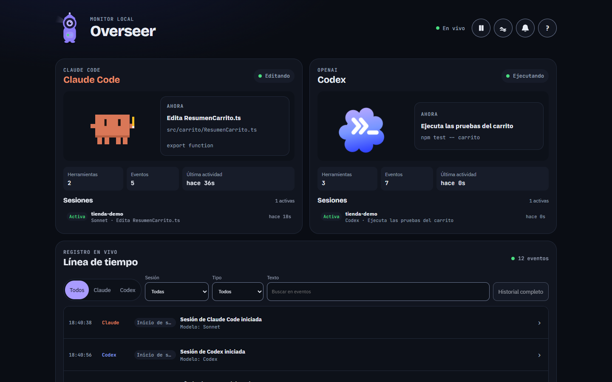
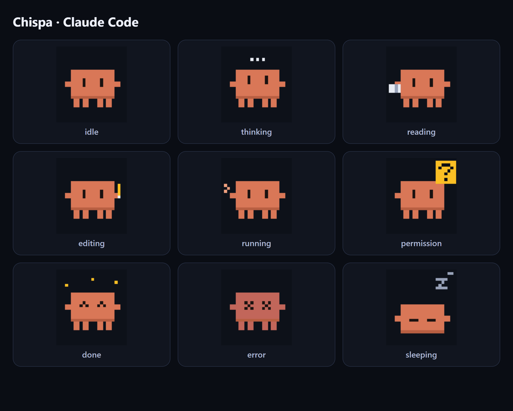
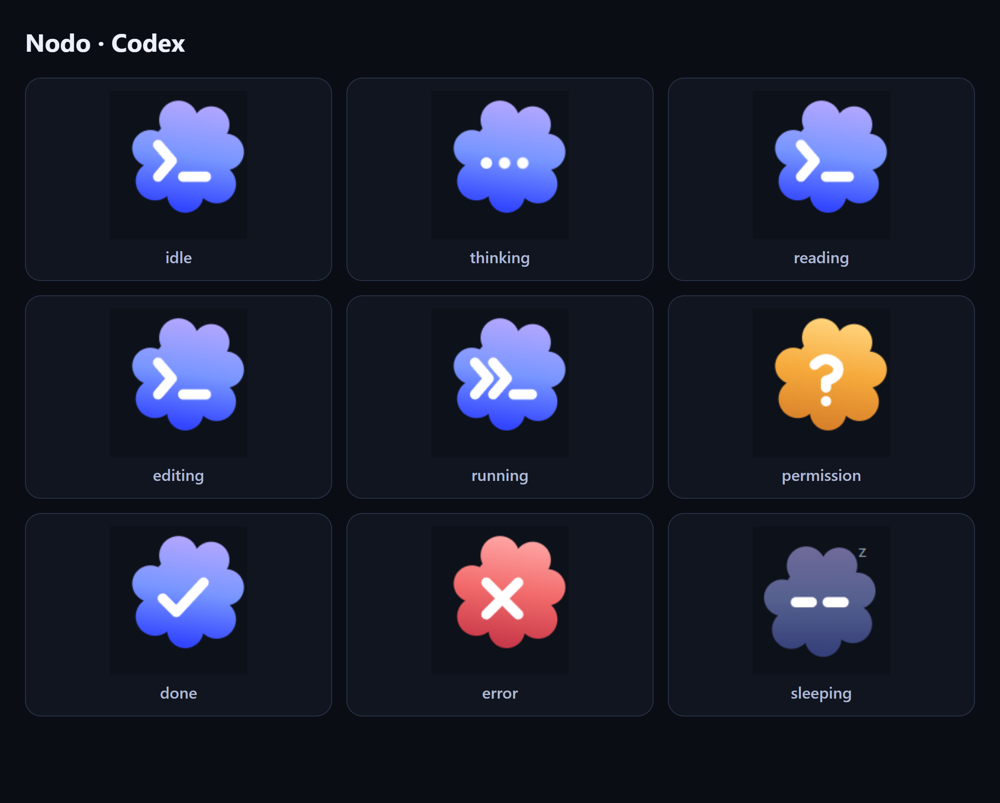
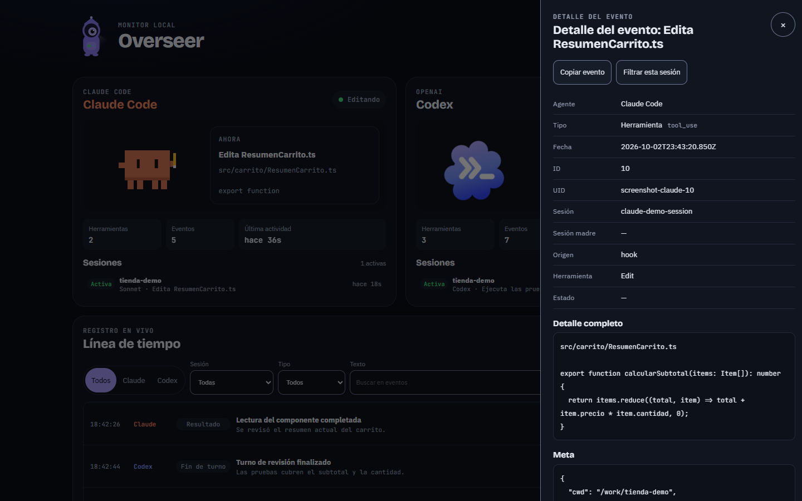
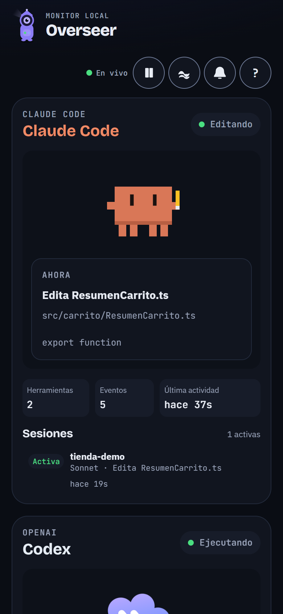
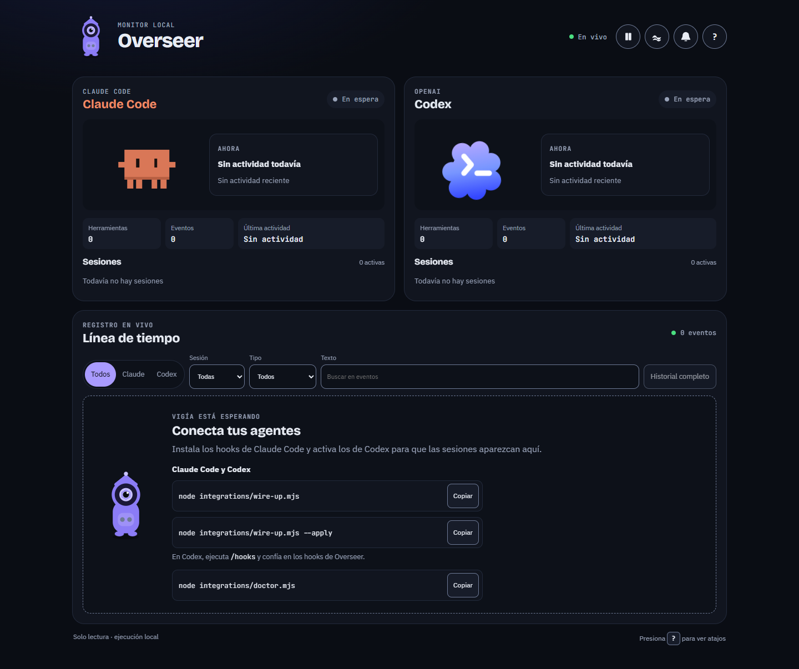
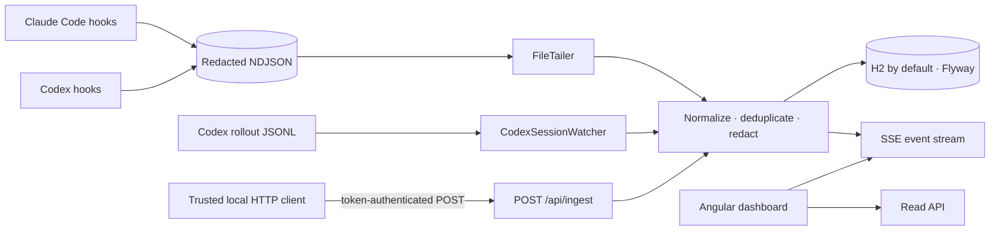

# Overseer
**A local, read-only activity monitor for Claude Code and Codex**<br>
*See both agents work in real time, with one animated mascot for each.*




---

### Overview
> Overseer is a local, real-time, read-only monitor for Claude Code and Codex. Each agent has an animated mascot that reflects its current activity, alongside sessions and a filterable event timeline.

---

### Mascots
#### Claude Code · Chispa


Chispa is an original pixel creature inspired by Claude Code's mascot. It shows nine states: idle, thinking, reading, editing, running, permission, done, error, and sleeping.

#### Codex · Nodo


Nodo is a cloud with a `>_` prompt inspired by the Codex icon. It shows nine states: idle, thinking, reading, editing, running, permission, done, error, and sleeping.

 Vigía is the project's lighthouse keeper.







---

### Key Engineering Decisions / Architecture
- **Observe only:** hooks and rollout readers collect agent activity; Overseer does not send commands to either agent.
- **Two Codex sources, one event stream:** Codex hooks and session rollouts complement each other. Stable `uid` values deduplicate matching events.
- **Resumable file reads:** the NDJSON tailer and rollout watcher persist byte offsets and resume after restarts or file truncation.
- **Replayable live updates:** Server-Sent Events (SSE) use database event IDs and `Last-Event-ID` to replay missed events after reconnecting.
- **Redact before storage:** hook output is redacted before it reaches the event file; the backend redacts again before persistence and broadcast.
- **Local access by default:** the ingest endpoint requires a local token, and the standalone server binds to `127.0.0.1` by default.
- **Bounded history:** event retention defaults to 14 days; set `AGENT_OPS_RETENTION_DAYS=0` to disable deletion. In-memory event buffers are bounded.
- **Tracked sessions:** sessions are `active`, `idle`, or `ended`; the idle threshold defaults to 10 minutes.
- **One mascot animation loop:** mascots share one `requestAnimationFrame` loop and one passive `pointermove` listener. Calm mode and `prefers-reduced-motion` stop continuous animation.
- **Container defaults:** Docker Compose uses H2 and runs the app as a non-root user. The host port is published on loopback.
- **Compatibility names:** Java package `com.agentops`, `spring.application.name`, `AGENT_OPS_*` variables, `~/.agent-ops/`, `X-Agent-Ops-Token`, Compose container `agent-ops`, the JAR name, npm package name, and `design-system/agent-ops/` remain unchanged for compatibility.



---

### Tech Stack
| Layer | Technologies |
| :--- | :--- |
| **Backend** | `Java 21` · `Spring Boot 3.5` · `Spring MVC` · `Spring Data JPA` |
| **Storage** | `H2` · `MySQL` (optional) · `Flyway` |
| **Frontend** | `Angular 22` · `TypeScript 6` · `RxJS` |
| **Integrations** | `Node.js 24` · `Claude Code hooks` · `Codex hooks and rollout JSONL` |
| **Verification** | `Maven` · `Vitest` · `Playwright` · `node:test` |
| **Packaging** | `Docker` · `Docker Compose` |

---

### Requirements
- **Docker run:** Docker Desktop and Node.js 24 for the host-side agent hooks. Java and Maven are not required for this path.
- **Local development:** Java 21 JDK, Maven 3.9 or newer, Node.js 24.15 or newer, and npm (Angular 22). Node.js is also required by the hooks, which invoke `node` from `PATH`.
- Claude Code and/or Codex installed as a CLI or desktop app.
- Git.
- Port `8787` for the application and port `4200` for the Angular development server.
- Tested on Windows 11. macOS and Linux should work, but have not been verified.

---

### Quickstart
Clone the repository and create the local Compose environment file:

```powershell
git clone https://github.com/FerS00/Overseer.git
cd Overseer
Copy-Item .env.example .env
```

Edit `.env` before starting Docker so its bind mounts point to the same host folders used by the hooks and Codex. The defaults mount empty repository-local folders, while hooks write to `~/.agent-ops/events.ndjson` and Codex stores rollouts in `~/.codex/sessions`; without these paths Docker starts without host activity. Choose the pair for your operating system and replace `<you>` with your profile name:

Windows:

```dotenv
AGENT_OPS_EVENTS_DIR=C:/Users/<you>/.agent-ops
AGENT_OPS_CODEX_SESSIONS_DIR=C:/Users/<you>/.codex/sessions
```

macOS/Linux (Linux example; on macOS use `/Users/<you>` for the home directory):

```dotenv
AGENT_OPS_EVENTS_DIR=/home/<you>/.agent-ops
AGENT_OPS_CODEX_SESSIONS_DIR=/home/<you>/.codex/sessions
```

Open `.env` in an editor and replace the two default values with the matching pair above.

Run the containerized app at `http://127.0.0.1:8787`:

```powershell
docker compose up -d --build
```

For local development, use two PowerShell terminals from the repository root. Start the backend in the first:

```powershell
cd backend
mvn spring-boot:run
```

Start the Angular frontend in the second:

```powershell
cd frontend
npm ci
npm start
```

The development UI is at `http://127.0.0.1:4200`; its proxy forwards API and SSE requests to port `8787`.

Connect the installed agents. Claude Code hooks are added to `~/.claude/settings.json`. Codex setup enables `[features] hooks = true` and adds hook entries to `~/.codex/config.toml`. Review the dry-run diff before applying; `--apply` creates timestamped backups of existing settings files. In Codex, open `/hooks` and trust the changed hooks. If you leave them untrusted, Overseer can still read Codex activity from `~/.codex/sessions` rollouts. Then run the diagnostic:

```powershell
node integrations/wire-up.mjs
node integrations/wire-up.mjs --apply
node integrations/doctor.mjs
```

Useful environment variables include `AGENT_OPS_EVENTS_DIR` and `AGENT_OPS_CODEX_SESSIONS_DIR` for Compose mounts, `AGENT_OPS_PORT` for the published port, and `AGENT_OPS_TOKEN_FILE` for the ingest token path. The standalone backend reads `AGENT_OPS_EVENTS_FILE`; the token defaults to `~/.agent-ops/token`.

Run the project checks from the repository root:

```powershell
cd backend; mvn test
cd ..\frontend; npm test
npm run e2e
cd ..; node --test integrations/
```

| Component | State |
| :--- | :--- |
| Claude Code hooks and stream integration | Implemented; Node tests included |
| Codex hooks and rollout reader | Implemented; Node and backend tests included |
| Local API, persistence, sessions, and SSE | Implemented; Maven tests included |
| Angular dashboard and mascot system | Implemented; Vitest and Playwright tests included |
| Desktop island window | Planned |

### Troubleshooting
- **The dashboard shows no events:** check that `.env` points `AGENT_OPS_EVENTS_DIR` and `AGENT_OPS_CODEX_SESSIONS_DIR` to the host folders above, then run `node integrations/doctor.mjs`.
- **Codex hook events are missing:** open `/hooks` in Codex and trust the configured hooks; rollout monitoring from the configured sessions directory remains available without hook trust.
- **Codex activity is missing:** verify `AGENT_OPS_CODEX_SESSIONS_DIR` points to the host's `.codex/sessions` directory.
- **Port 8787 is occupied:** set `AGENT_OPS_PORT` in `.env` to another available host port.
- **The container is unhealthy:** inspect `docker logs agent-ops` and the `/api/diagnostics` response.

Guides: [Project guide](docs/PROJECT_GUIDE.md) · [Architecture](docs/ARCHITECTURE.md) · [Configuration](docs/CONFIGURATION.md) · [Adding an agent](docs/ADDING-AN-AGENT.md) · [Design system](design-system/agent-ops/DESIGN.md).

---

### License
Released under the [MIT License](LICENSE).

Attribution: please keep the copyright notice and credit **Fernando Morales Peña (FerS00)** as the original author — see [NOTICE](NOTICE).

Brand and mascot notes are in [NOTICE](NOTICE).

**Author:** [FerS00](https://github.com/FerS00)
