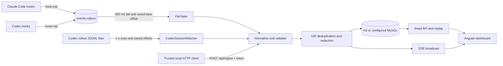

# Architecture

Overseer is a local observer. Agent hooks and Codex rollout readers publish normalized events; the backend validates, redacts, deduplicates, persists, tracks sessions, and sends updates to the Angular UI.

## Data flow

### Event sources

- `integrations/hook.mjs` maps Claude Code and Codex hook input to the normalized event shape. `integrations/emit.mjs` redacts fields and appends UTF-8 NDJSON to `~/.agent-ops/events.ndjson` by default. Hooks return `{}` and swallow malformed input so they do not interrupt the agent.
- `FileTailer` polls the shared NDJSON file every 400 ms. It reads complete newline-terminated records and persists the byte offset in `ingest_offsets`; incomplete trailing lines wait for a later poll. If a file shrinks, its offset resets.
- `CodexSessionWatcher` scans `~/.codex/sessions` every second for rollout JSONL files modified within the last 24 hours. It reads the Codex `session_meta`, `turn_context`, `event_msg`, and `response_item` records, including child rollout files, and stores a separate offset for each file. Each scan reads at most 4 MiB from a file. Truncated files are reread from byte zero.
- `POST /api/ingest` accepts one event, an array, or an object with an `events` array. It requires `X-Agent-Ops-Token`; this route is available for trusted local integrations and is not used by the dashboard.
- The configured hooks, `claude-stream.mjs`, and `demo-feed.mjs` call `emit()` and append NDJSON; they do not call this HTTP route. The token is for tools that explicitly POST to `/api/ingest`.

### Normalized event contract

The Node integration test names its emitted hook shape **contract v2**. The JSON record contains `uid`, `source_key`, `ts`, `agent`, `session_id`, `parent_session_id`, `source`, `type`, `status`, `title`, `detail`, `tool`, and `meta`. There is no separate `schema_version` field in the emitted record. `source` is one of `hook`, `rollout`, `ingest`, or `stream`; agents are restricted to `claude` and `codex`; event types are normalized to the supported set, with unknown types falling back to `note`.

For hook events, the stable UID is the lowercase SHA-256 hex digest of UTF-8 `agent + LF + session_id + LF + source_key`. A missing or invalid UID supplied to the backend is regenerated from the same inputs; if there is no source key, the backend creates one. Rollout parsing supplies source keys for session, turn, message, reasoning, and tool-call records. `agent_events.uid` has a unique index, so duplicate hook/rollout events are rejected before broadcasting and counted as `duplicate_uid`. Persistence integrity conflicts are counted the same way.

The backend accepts at most 256 KiB per ingest HTTP body and 500 events per batch. `detail` is capped at 2,000 characters during normalization. Unsupported or missing agent IDs are discarded and counted in diagnostics.

### Persistence and replay

Flyway migrations create the event table and then evolve it in order:

| Migration | Change |
| :--- | :--- |
| `V1__baseline.sql` | Initial `agent_events` table. |
| `V2__ingest_offsets.sql` | `ingest_offsets` table for source-file cursors. |
| `V3__sessions.sql` | Session table and indexes; event UID, session, parent-session, and source fields; unique UID index. |
| `V4__session_event_lookup.sql` | Index for event lookups by session and database ID. |

H2 file storage is the default. MySQL can be selected by setting the database URL, user, password, and driver. An in-memory event buffer keeps up to 3,000 events for live state; the API reads persisted rows when a requested page goes beyond that buffer.

The `/events` SSE endpoint sends named `event` messages with the database ID as the SSE ID. On reconnect the frontend supplies `Last-Event-ID` when the browser provides it; it also uses the `lastEventId` query parameter because browser `EventSource` cannot set arbitrary request headers. The backend replays later database rows before continuing the live stream. A 20-second SSE comment is used as a heartbeat.

### Sessions

Events update persisted sessions with agent, working directory, model, start time, last-event time, end time, and optional parent session ID. A session is `ended` after a `session_end` event. Otherwise it is `idle` when its last event is at least `AGENT_OPS_SESSION_IDLE_MINUTES` old (10 minutes by default), and `active` before that threshold. A later event can reopen an ended session. Rollout filenames associate child sessions with their parent.

### Redaction and retention

The Node emitter redacts event text and nested metadata before writing NDJSON. The backend redacts again during event normalization and before serialization or SSE broadcast. Redaction covers OpenAI-style keys, GitHub tokens, AWS access-key IDs, bearer values, authorization headers, password/token/secret/API-key assignments, and PEM private-key blocks.

Retention runs at startup and hourly. The default is 14 days; a value of zero or less disables event deletion. Offsets pointing to source files that no longer exist are removed. Retention does not delete the source event file or Codex rollout files.

### Mascot rendering

`MascotEngine` installs one passive `pointermove` listener and schedules at most one shared `requestAnimationFrame` loop for all registered mascots. It stops the loop when no mascots are registered, the document is hidden, calm mode is enabled, or `prefers-reduced-motion` is active. Calm mode persists in browser storage. `MascotStateService` maps event types and tool names to idle, thinking, reading, editing, running, permission, done, error, and sleeping states, and coalesces state updates to at most four per second.
