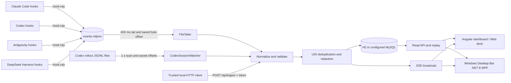

# Architecture

Overseer is a local observer. Agent hooks and Codex rollout readers publish normalized events; the backend validates, redacts, deduplicates, persists, tracks sessions, and sends updates to the Angular UI.

## Data flow

### Event sources

- `integrations/hook.mjs` maps Claude Code, Codex, Antigravity, and DeepSeek Harness hook input (Antigravity receives its event name as the third CLI argument) to the normalized event shape. For Antigravity, `PreInvocation` captures the active model and step, `PostInvocation` records the answering model, `PostToolUse` reports tool execution status and outputs, and `Stop` documents completion or failure reasons. `integrations/emit.mjs` redacts fields and appends UTF-8 NDJSON to `~/.agent-ops/events.ndjson` by default. Hooks swallow malformed input; Antigravity Stop returns its documented allow response, and other observed events return `{}`.
- `FileTailer` polls the shared NDJSON file every 400 ms. It reads complete newline-terminated records and persists the byte offset in `ingest_offsets`; incomplete trailing lines wait for a later poll. If a file shrinks, its offset resets.
- `CodexSessionWatcher` scans `~/.codex/sessions` every second for rollout JSONL files modified within the last 24 hours. It reads the Codex `session_meta`, `turn_context`, `event_msg`, and `response_item` records, including child rollout files, and stores a separate offset for each file. Each scan reads at most 4 MiB from a file. Truncated files are reread from byte zero.
- `POST /api/ingest` accepts one event, an array, or an object with an `events` array. It requires `X-Agent-Ops-Token`; this route is available for trusted local integrations and is not used by the dashboard.
- The configured hooks, `claude-stream.mjs`, and `demo-feed.mjs` call `emit()` and append NDJSON; they do not call this HTTP route. The token is for tools that explicitly POST to `/api/ingest`.

### Normalized event contract

The Node integration test names its emitted hook shape **contract v2**. The JSON record contains `uid`, `source_key`, `ts`, `agent`, `session_id`, `parent_session_id`, `source`, `type`, `status`, `title`, `detail`, `tool`, and `meta`. There is no separate `schema_version` field in the emitted record. `source` is one of `hook`, `rollout`, `ingest`, or `stream`; registered agents are Claude Code, Codex, Antigravity, and DeepSeek Harness; event types are normalized to the supported set, with unknown types falling back to `note`.

For hook events, the stable UID is the lowercase SHA-256 hex digest of UTF-8 `agent + LF + session_id + LF + source_key`. A missing or invalid UID supplied to the backend is regenerated from the same inputs; if there is no source key, the backend creates one. Rollout parsing supplies source keys for session, turn, message, reasoning, and tool-call records. `agent_events.uid` has a unique index, so duplicate hook/rollout events are rejected before broadcasting and counted as `duplicate_uid`. Persistence integrity conflicts are counted the same way.

The backend accepts at most 256 KiB per ingest HTTP body and 500 events per batch. `detail` is capped at 2,000 characters during normalization. Unsupported or missing agent IDs are discarded and counted in diagnostics.

### Persistence and replay

Flyway migrations create the event table and then evolve it in order:

| Migration | Change |
| :--- | :--- |
| `V1__baseline.sql` | Initial `agent_events` table. |
| `V2__ingest_offsets.sql` | `ingest_offsets` table for source-file cursors. |
| `V3__sessions.sql` | Session table and indexes; event UID, session, parent-session, and source fields; unique UID index. |
| `V4__session_event_lookup.sql` | Index for event lookups by session and database ID. |
| `V5__ui_preferences.sql` | Per-installation JSON view preferences. |

`GET /api/agents` returns the fixed four-profile catalog and marker-only installation detection. It checks configured home paths and known agent directories without reading marker contents; `AGENT_OPS_AGENTS` can override detection for containers. `GET/PUT /api/preferences` validates the four-agent ordering and visibility plus layout, density, and focus settings. The browser stores a local fallback if the API cannot be reached.

H2 file storage is the default. MySQL can be selected by setting the database URL, user, password, and driver. An in-memory event buffer keeps up to 3,000 events for live state; the API reads persisted rows when a requested page goes beyond that buffer.

The `/events` SSE endpoint sends named `event` messages with the database ID as the SSE ID. On reconnect the frontend supplies `Last-Event-ID` when the browser provides it; it also uses the `lastEventId` query parameter because browser `EventSource` cannot set arbitrary request headers. The backend replays later database rows before continuing the live stream. A 20-second SSE comment is used as a heartbeat.

### Sessions

Events update persisted sessions with agent, working directory, model, start time, last-event time, end time, and optional parent session ID. A session is `ended` after a `session_end` event. Otherwise it is `idle` when its last event is at least `AGENT_OPS_SESSION_IDLE_MINUTES` old (10 minutes by default), and `active` before that threshold. A later event can reopen an ended session. Rollout filenames associate child sessions with their parent.

### Redaction and retention

The Node emitter redacts event text and nested metadata before writing NDJSON. The backend redacts again during event normalization and before serialization or SSE broadcast. Redaction covers OpenAI-style keys, GitHub tokens, AWS access-key IDs, bearer values, authorization headers, password/token/secret/API-key assignments, and PEM private-key blocks.

Retention runs at startup and hourly. The default is 14 days; a value of zero or less disables event deletion. Offsets pointing to source files that no longer exist are removed. Retention does not delete the source event file or Codex rollout files.

### Mascot rendering

`MascotEngine` installs one passive `pointermove` listener and schedules at most one shared `requestAnimationFrame` loop for all registered mascots. It stops the loop when no mascots are registered, the document is hidden, calm mode is enabled, or `prefers-reduced-motion` is active. Calm mode persists in browser storage. `MascotStateService` maps event types and tool names to idle, thinking, reading, editing, running, permission, done, error, and sleeping states, and coalesces state updates to at most four per second.

The SVG geometry and CSS state animations come from the approved `design-system/agent-ops/prototype-v4.html`. Gaze sampling runs outside Angular, smoothly follows the pointer, and turns toward the next visible cabin after 4.5 seconds of inactivity. Its shared schedule slows to 4 Hz after settling; the CSS animations retain the prototype timings. Unique gradient IDs avoid collisions between instances. Michi maps the global state to the prototype moods and receives ordered `{ id, color, state }` indicators for its visible-agent collar; its ears turn toward the last active cabin. The frontend validates SSE agent IDs against `AGENT_PROFILES`, including Antigravity and DeepSeek.

The Playwright suite compares all five SVGs, visible shapes, gradient colors, animation targets, timings, and keyframes against the reference for all nine states. It also checks pointer/click behavior, collar order, calm/reduced motion, simulated tab visibility, and synthetic SSE events through the normal event reader.

The catalog pairs Claude Code with Chispa, Codex with Nodo, Antigravity with Astro, and DeepSeek Harness with Hondo. Michi summarizes visible agent state with error > permission > active > done > sleeping > idle priority.

### Activity sub-states and the dock

`activity.ts` classifies reading, editing and running events into twelve sub-states from the tool name and the shell command (`meta.command`, or the event detail for shell tools). Compound commands are classified by their last segment, so `npm ci && npm test` counts as tests. `describeTarget` picks the file, files, tree, URL, command or subagents shown to the user, using only fields the backend has already redacted. Antigravity and DeepSeek file, search and web tools (`view_file`, `list_dir`, `grep_search`, `replace_file_content`, …) map to reading or editing in the base classifier.

`MascotStateService` publishes a snapshot per agent with the state, sub-state, target, tool, session, active subagents (child sessions plus Claude Code SubagentStart/Stop notes) and `stateSince`, which only moves when the state/sub-state pair changes. Snapshots share the four-per-second publication limit with the states.

`AgentPetComponent` wraps a mascot: `data-activity` drives CSS container motion and `DwellScheduler` plays a glance, stretch or shuffle every 6–11 s after 20 s in the same active sub-state. It registers with `MascotEngine`, so the dock still uses the single shared loop, and does nothing in calm mode. Dock rings and flyout clocks use the existing one-second clock with a CSS transition.

`DockBarComponent` renders the slots for detected agents that are not hidden in the dock, in `agentOrder`, with roving focus. `AgentFlyoutComponent` is a non-modal dialog positioned under its slot and clamped to the viewport. `ViewSettingsComponent` is a native modal `<dialog>`. `PreferencesService` owns loading, partial updates, serialized PUTs and the browser copy, and starts from that copy so dock mode does not flash the cabins.

### Desktop bar

`desktop/` is a second read-only client. `Overseer.Desktop.Core` (net8.0, no UI) ports the event classifier, sub-states and done/sleep transitions, parses the SSE stream, and draws the four mascots through `IMascotCanvas`: the WPF app implements it over `DrawingContext`, and an SVG implementation lets the tests render every mascot and state on any OS. The WPF app redraws visible mascots from a single `CompositionTarget.Rendering` handler, paused when the bar is hidden and stopped in calm mode. `LiveConnection` seeds the last 200 events, follows `/events` with `Last-Event-ID`, reconnects with backoff and refreshes agents and preferences every 30 seconds.

### Interaction and preference ordering

Cabin selection is an ephemeral signal. A batch hide performs one hiddenAgents update and one queued PUT, keeping all unselected agents and the event history intact. The native details/summary menu exposes the same reordering operation as dragging, with keyboard/touch buttons. Reordering visible cabins preserves hidden positions. The dock fields (`viewMode`, `dockHiddenAgents`, `dockSize`) are optional in `PUT /api/preferences`; the server merges the request over the stored document before validating it. Loaded agentOrder retains the saved sequence, filters unknown/duplicate ids, and appends missing supported ids. Saves are serialized to prevent a slower older request from overwriting a newer view.

Historical database queries use parameter placeholders derived from AgentProfiles, so all four supported agents survive cache misses, pagination, and restart. Unregistered stored agents remain excluded.
